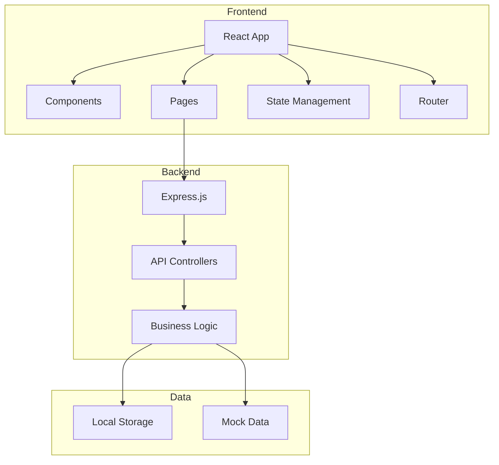
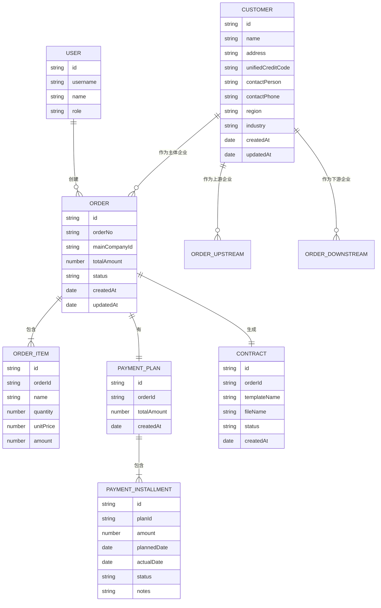

# 供应链金融工作平台 - 技术架构文档

## 1. Architecture Design


## 2. Technology Description
- **Frontend**: React@18 + TypeScript + tailwindcss@3 + Vite + React Router + Zustand
- **Initialization Tool**: vite-init (react-express-ts template)
- **Backend**: Express.js@4 + TypeScript
- **Database**: LocalStorage (for MVP) + Mock Data
- **File Handling**: File System API for Word template uploads
- **UI Library**: lucide-react icons + custom Tailwind components

## 3. Route Definitions
| Route | Purpose |
|-------|---------|
| /login | 用户登录页面 |
| /dashboard | 首页/数据概览 |
| /customers | 客户管理列表 |
| /customers/new | 新建客户 |
| /customers/:id | 客户详情/编辑 |
| /orders | 订单管理列表 |
| /orders/new | 新建订单 |
| /orders/:id | 订单详情/编辑 |
| /orders/:id/payments | 回款管理 |
| /contracts | 合同管理 |
| /contracts/new | 新建合同 |
| /system | 系统管理 |

## 4. API Definitions

### 4.1 TypeScript 类型定义
```typescript
// 客户类型
interface Customer {
  id: string;
  name: string;
  address: string;
  unifiedCreditCode: string;
  contactPerson: string;
  contactPhone: string;
  region: string;
  industry: string;
  createdAt: Date;
  updatedAt: Date;
}

// 订单类型
interface Order {
  id: string;
  orderNo: string;
  mainCompany: Customer;
  upstreamCompanies: Customer[];
  downstreamCompanies: Customer[];
  totalAmount: number;
  status: 'draft' | 'active' | 'completed' | 'cancelled';
  items: OrderItem[];
  createdAt: Date;
  updatedAt: Date;
}

interface OrderItem {
  id: string;
  name: string;
  quantity: number;
  unitPrice: number;
  amount: number;
}

// 回款计划类型
interface PaymentPlan {
  id: string;
  orderId: string;
  totalAmount: number;
  installments: PaymentInstallment[];
  createdAt: Date;
}

interface PaymentInstallment {
  id: string;
  amount: number;
  plannedDate: Date;
  actualDate?: Date;
  status: 'pending' | 'processing' | 'completed';
  notes?: string;
}

// 合同类型
interface Contract {
  id: string;
  orderId: string;
  templateName: string;
  fileName: string;
  status: 'draft' | 'generated';
  createdAt: Date;
}

// 用户类型
interface User {
  id: string;
  username: string;
  name: string;
  role: 'admin' | 'user';
}
```

### 4.2 API 端点
| Method | Path | Description |
|--------|------|-------------|
| GET | /api/customers | 获取客户列表 |
| POST | /api/customers | 创建客户 |
| PUT | /api/customers/:id | 更新客户 |
| DELETE | /api/customers/:id | 删除客户 |
| GET | /api/orders | 获取订单列表 |
| POST | /api/orders | 创建订单 |
| PUT | /api/orders/:id | 更新订单 |
| GET | /api/orders/:id/payment-plan | 获取回款计划 |
| POST | /api/orders/:id/payment-plan | 生成回款计划 |
| PUT | /api/payments/:id | 更新回款状态 |
| POST | /api/contracts/generate | 生成合同 |
| GET | /api/contracts/:id/download | 下载合同 |

## 5. Data Model

### 5.1 ER 图


### 5.2 业务逻辑说明

#### 回款计划分配算法
- 单笔最大金额：500,000 元
- 分配规则：
  1. 计算总金额 = 订单总金额
  2. 如果总金额 ≤ 50万，则 1 笔完成
  3. 如果总金额 > 50万，则：
     - 笔数 = 向上取整(总金额 / 50万)
     - 前 n-1 笔 = 50万
     - 最后一笔 = 总金额 - (n-1) * 50万
- 每笔计划日期间隔默认设置为 1 天

## 6. 项目结构
```
供应链金融/
├── src/
│   ├── components/        # 共享组件
│   │   ├── Layout.tsx
│   │   ├── Sidebar.tsx
│   │   ├── Header.tsx
│   │   ├── DataTable.tsx
│   │   ├── Modal.tsx
│   │   └── Toast.tsx
│   ├── pages/             # 页面组件
│   │   ├── Login.tsx
│   │   ├── Dashboard.tsx
│   │   ├── Customers/
│   │   ├── Orders/
│   │   ├── Payments/
│   │   ├── Contracts/
│   │   └── System/
│   ├── hooks/             # 自定义 Hooks
│   │   ├── useAuth.ts
│   │   └── useStore.ts
│   ├── utils/             # 工具函数
│   │   ├── paymentCalculator.ts
│   │   ├── formatters.ts
│   │   └── validators.ts
│   ├── types/             # 类型定义
│   │   └── index.ts
│   ├── store/             # Zustand Store
│   │   └── index.ts
│   ├── App.tsx
│   └── main.tsx
├── api/                   # 后端 API
│   ├── routes/
│   │   ├── customers.ts
│   │   ├── orders.ts
│   │   ├── payments.ts
│   │   └── contracts.ts
│   ├── services/
│   ├── types/
│   └── server.ts
├── shared/                # 共享类型
├── public/                # 静态资源
└── package.json
```
