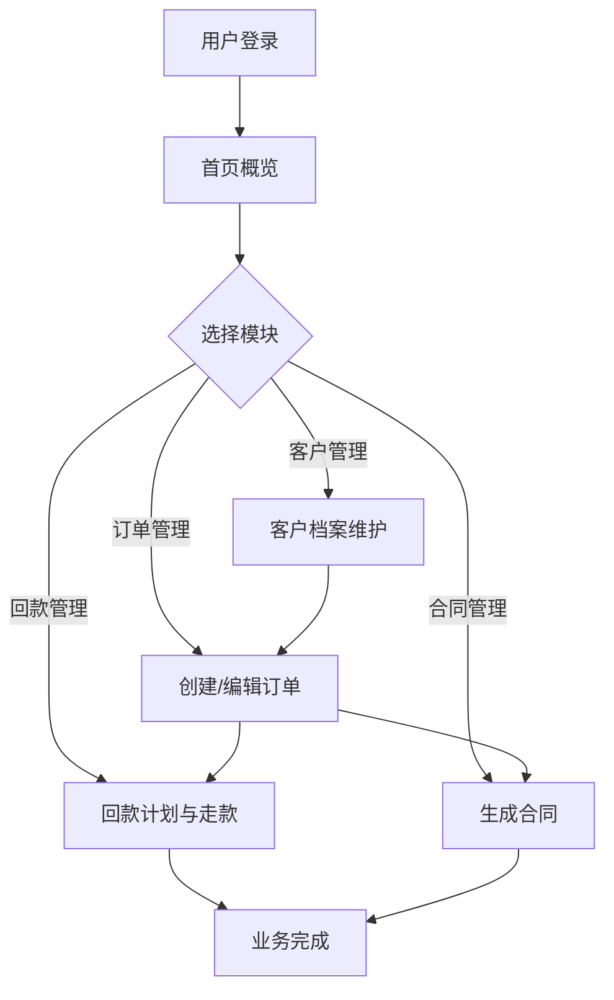

# 供应链金融工作平台 - 产品需求文档

## 1. Product Overview
供应链金融工作平台是一款综合性的供应链管理系统，旨在帮助企业高效管理客户、订单、回款和合同流程。
- 主要服务于需要进行供应链管理的企业用户，解决客户档案维护、订单上下游关系管理、回款计划分配和合同生成等核心问题
- 提升供应链管理效率，降低运营成本，实现业务流程的数字化和规范化

## 2. Core Features

### 2.1 User Roles
| Role | Registration Method | Core Permissions |
|------|---------------------|------------------|
| 管理员 | 系统预设 | 全部功能权限，包括用户管理和权限配置 |
| 普通用户 | 管理员添加 | 客户、订单、回款、合同的查看和操作权限 |

### 2.2 Feature Module
1. **登录/首页**: 用户认证、系统概览、快捷操作入口
2. **客户管理**: 客户档案创建、编辑、查询、列表展示
3. **订单管理**: 订单创建、上下游企业配置、状态跟踪
4. **回款管理**: 回款计划自动生成、走款确认、进度调整
5. **合同管理**: Word模板导入、合同自动生成、合同下载
6. **系统管理**: 用户权限管理、系统配置

### 2.3 Page Details
| Page Name | Module Name | Feature description |
|-----------|-------------|---------------------|
| 登录页 | 登录表单 | 用户登录认证、记住登录状态 |
| 首页 | 数据概览 | 展示关键指标统计、最近活动、快捷操作 |
| 客户管理 | 客户列表 | 分页展示客户列表、搜索过滤、批量操作 |
| 客户管理 | 客户详情/编辑 | 完整客户信息展示、编辑功能 |
| 订单管理 | 订单列表 | 订单列表展示、状态筛选、查询 |
| 订单管理 | 订单创建/编辑 | 上下游企业配置、商品明细、金额计算 |
| 回款管理 | 回款计划 | 自动生成小额多笔回款计划（≤50万/笔） |
| 回款管理 | 走款确认 | 逐笔确认走款、状态更新、进度调整 |
| 合同管理 | 模板管理 | Word模板上传、模板预览 |
| 合同管理 | 合同生成 | 根据订单和模板自动生成合同、下载 |
| 系统管理 | 用户管理 | 用户创建、权限分配、角色管理 |

## 3. Core Process

### 3.1 主业务流程
用户登录 → 客户管理（创建或维护客户档案）→ 订单管理（创建订单，配置上下游企业）→ 回款管理（自动生成回款计划，确认走款）→ 合同管理（生成并下载合同）

### 3.2 流程图

## 4. User Interface Design

### 4.1 Design Style
- 主色调：深蓝色 (#1e40af)，次色调：浅蓝色 (#3b82f6)，强调色：绿色 (#10b981)
- 按钮风格：圆角矩形，渐变背景，悬停时有轻微缩放动画
- 字体：使用 Inter 作为主字体，标题使用 Semibold，正文使用 Regular
- 布局风格：左侧导航 + 顶部标题栏 + 内容区域卡片式布局
- 图标风格：使用 lucide-react 线性图标，简洁专业

### 4.2 Page Design Overview
| Page Name | Module Name | UI Elements |
|-----------|-------------|-------------|
| 登录页 | 登录卡片 | 居中布局，渐变背景，输入框带图标，登录按钮有动效 |
| 首页 | 数据统计卡片 | 4个统计卡片（客户数、订单数、回款金额、合同数），带图标和数值 |
| 客户列表 | 表格 | 表头固定，斑马纹行，操作按钮悬停高亮 |
| 订单表单 | 上下游配置 | 可动态增删的上游/下游企业卡片，拖拽排序 |
| 回款计划 | 进度条 | 可视化回款进度，每笔回款状态标签 |
| 合同预览 | 文件预览 | Word模板缩略图，生成按钮带加载状态 |

### 4.3 Responsiveness
- 桌面端优先设计，适配 1280px 以上屏幕
- 平板/移动端使用响应式布局，表格转为卡片列表
- 导航在小屏幕转为抽屉式菜单
- 触摸交互优化，按钮最小尺寸 44px

### 4.4 交互细节
- 页面切换时使用淡入动画
- 表单验证有即时反馈
- 操作成功/失败使用 Toast 提示
- 数据加载显示骨架屏
